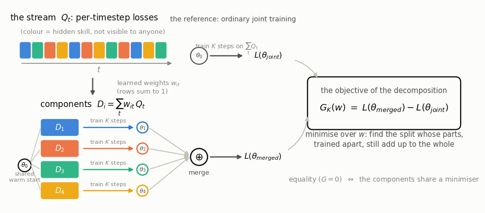
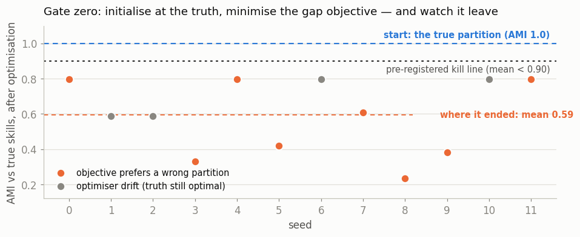
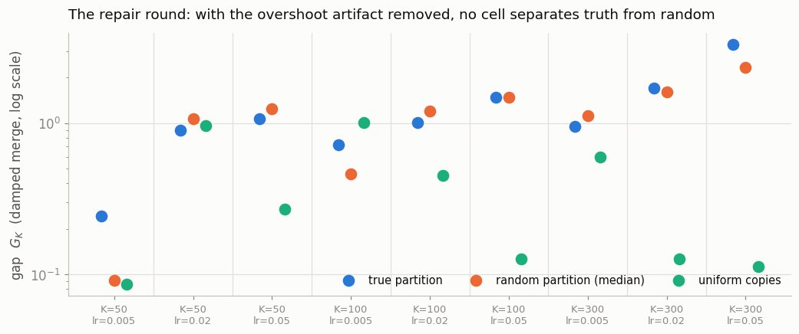

# The Price of Coupling

So this project started from a simple observation - every training loss is a sum,
thousands of per-timestep contributions handed to an optimiser as one number, and the
sum hides whatever anatomy the task actually has. I wanted to see whether you could
learn that anatomy directly: choose the decomposition that closes the gap between the
minimum of the sum and the sum of the minima. This piece writes down exactly what
that would mean, and reports what happened when I optimised it directly, with the
pass/fail lines fixed in advance, before any experiment ran. The short version is
that the gate I'd built specifically to catch a lying objective ended up catching
this one. All in, it cost about three CPU-hours and ruled out two objectives - and to
be frank, working out *why* it came apart is probably worth more than the result
itself would have been.

**Code, data, and the honest revalidation trail live in the accompanying repository,
under [reboot/](reboot/). I am now reworking this project from the ground up - what
follows is the record of the first attempt.**

---

## Why decompose?

Almost everything we train is graded by a sum: $L = \sum_t Q_t$, thousands of
per-timestep loss contributions handed to an optimiser as one number - the index $t$
is really just bookkeeping. If the objective is secretly built from a few underlying
skills, the sum doesn't say which contributions belong to which skill, and gradient
descent, which only ever sees the sum, can't care either way.

I wanted the anatomy for three reasons, none of which really depend on how this story
ends. Partly for parallelism - if the skills separate even approximately, you can
curate data for one skill and train on it without trampling the others, every skill at
once on separate workers, ideally with autonomy granted gradually as each part proves
it can train alone without regressing the whole. Partly because a factored loss is
just a richer game than a monolithic one - a single number admits exactly one move
(descend it), whereas a decomposition lets you schedule, reweight, and even
restructure the decomposition itself, which is essentially editing the source instead
of the compiled binary. And partly out of a conviction that the most relevant
coordinates for a problem are a property of relationships between states or their
latents, rather than something fixed in advance - so the decomposition should be
learned, and learnable *as it moves*, not bolted on afterwards by a clustering pass.

The test for whether a split is real is blunt in a way I quite liked - train the parts
apart, glue the results together, and see whether the glued model matches the one
trained jointly (if the syllabus really was four courses, four students studying
separately should be able to reconstruct the class between them).

## So what's the actual objective?

For any decomposition of the stream into components $D_i = f_i(\{Q_t\})$ with
$\sum_i D_i = \sum_t Q_t$,

$$\min_\theta \sum_t Q_t(\theta) \;\geq\; \sum_i \min_\theta D_i(\theta),$$

with equality exactly when the components share a common minimiser. The gap is the
**price of coupling** - what you lose by optimising the parts separately instead of
together. My proposal was to make the gap itself the training objective of the
decomposition. Why not ask directly for the split whose parts, trained apart, still
add up to the whole?

The picture that makes this a *skills* story: a component holding one skill's data
should pin down the parameter directions that skill needs, and be flat - indifferent -
everywhere else. Flat components have large sets of minimisers, and the equality asks
that all those sets intersect, with the joint optimum sitting in the intersection. (A
component whose minimiser is a single point would be something else entirely - a
dataset that determines the whole solution by itself.) There's a bonus if it works,
too: the *residual* gap, at the best achievable decomposition, is a measurement of the
task - how much coupling is intrinsic, in loss units.

Exact inner minimisation is intractable - evaluating the right-hand side means running
$P$ optimisations to convergence, for components that are themselves being learned -
so the operational form is what I called **merge fidelity**. From a shared warm start,
train one copy per component for $K$ steps, merge the updates (merging here means the
bluntest thing available - literally add the weight updates together), and score the
merged model against $K$ steps of ordinary joint training. That score is the
operational gap $G_K(w)$, a function of the soft partition weights $w$ that assign
loss channels to components. The partition $w$ is the learned object in all of this -
$G_K(w) \ge 0$ in expectation, and minimising it over $w$ is asking for components
that can be trained apart without cost.

One scope note worth being upfront about: the formulation allows any
$D_i = f_i(\{Q_t\})$, but what I actually optimised was the simplest family inside
it - a soft assignment of whole loss channels to components, which is linear in the
$Q_t$'s. That was a deliberate first rung rather than an oversight - the synthetic
worlds here were built additively from known skills, so the true decomposition
genuinely lives inside the linear family, and if the objective couldn't find it even
there, expressivity wasn't the bottleneck. But for real streams there's no reason the
anatomy should be linear in the coordinates you happen to observe - the more
interesting version is learning a nonlinear reframing of the stream under the same
sum constraint, a frame in which the anatomy actually becomes separable. That's
untested here, and it's on the list for the ground-up rework - though it only becomes
worth testing once there's an objective whose minimum is the true decomposition,
which is exactly the open question this record ends on.

*The soft partition $w$ is the learned object. $G_K(w) \ge 0$ in expectation, and
minimising it over $w$ asks for components that can be trained apart without cost.*

One degeneracy is visible before you run anything, and needs naming: components that
are *scaled copies* of the whole loss ($D_i = c_i L$) share a minimiser trivially and
decompose nothing. I guarded the exclusion with a disjointness penalty on the
partition weights - though, as it turned out, the objective itself had much stronger
opinions about this family than the penalty did.

Before building any of this I searched nine adjacent literatures for the object
([the sweep, per-area verdicts included](reboot/NOVELTY.md)) - partly due diligence,
partly paranoia that someone had already done it and called it something boring. The
nearest relatives: reward decompositions optimised for independence (Grimm & Singh
2019), the IGM condition in multi-agent RL - equality of argmaxes by construction,
over actions, with the partition given - and partition-train-merge pipelines whose
partitions come from proxies like embedding clustering (c-BTM) or gradient conflict
(MERIT). In federated learning the gap itself even has a standard name, the
heterogeneity constant $\Gamma = F^* - \sum_k p_k F_k^*$, where it's assumed for a
given client partition and used in convergence bounds - and, as far as I could find,
never used as a trainable objective over a learned decomposition. Which I took as
reason enough to actually run the experiment.

## Rules first

Everything below was pre-registered - the gate numbers (the pass/fail lines) fixed and
committed (dated, in [the repo history](reboot/DESIGN.md)) before any experiment ran,
deviations logged with cause, and one repair round pre-committed as the maximum.

The main gate came out of an earlier attempt at this problem, so a quick bit of
history first. That attempt went through a *proxy* objective (gradient affinity), and
failed in a very specific way - warm-started at the true decomposition, its objective preferred to
leave. That write-up ([archived here](legacy/OPBF-autopsy.md), deprecated) contributed
exactly one thing to the present project: the test became **gate zero**. Before any
recovery claims run, calibrate $K$ so that a random partition is measurably worse than
the true one (Z1 - if no affordable $K$ separates them, the environment can't test the
claim at all); then initialise the decomposition *at the true partition* and let the
gap objective keep training (Z2). If it walks away from the answer, the objective is
wrong and the project stops there, before any of the headline experiments get run.

First things first though, a testbed: synthetic multi-task regression with known
ground truth - twelve per-timestep loss channels in four latent skill groups, a small
shared trunk, soft partition weights $w \in \mathbb{R}^{12 \times 4}$ optimised by
evolution strategies (no unrolling bias), inner training by SGD. That last choice was
itself a logged finding: Adam's per-parameter normalisation moves zero-gradient
parameters at full step size, which quietly destroys *any* additive merge regardless
of partition quality. So, useful fact if you ever go near this stuff - Adam breaks
merging.

## Gate zero

Z1 passed at $K = 100$, with one pleasant surprise along the way: the scaled-copy
family I had planned to exclude by penalty gets wiped out by the objective on its own -
duplicated mass makes the summed updates overshoot catastrophically ($G \approx 191$
against the truth's $\approx 1.0$). So far so good! Then Z2 ran, and that's where it came apart.

*Twelve seeds, each initialised at the true partition, each fully optimised on the
gap objective. Mean final agreement with the truth: 0.59, far below the
pre-registered fail line of 0.90.* ([raw results](reboot/results/z2.json))

So that's a fail on the line fixed in advance (the agreement score is adjusted mutual
information between the learned grouping and the true one - 1.0 means identical, 0
means unrelated). The seeds were initialised at the answer, and the objective walked
away from it.

The important question - is this the objective's preference, or just optimiser noise? -
has an optimiser-free answer: evaluate the objective at the true partition and at all
36 single-task-moved neighbours. On 8 of 12 seeds the truth is not even a local
optimum - moving one task out of its true group strictly improves the objective
([diagnostics](reboot/results/diag_z2.json)). Under the pre-registered secondary merge
operator, parameter averaging, it's worse: the global ordering *inverts* on 12 of 12
seeds, so averaging ends up rewarding mixing - averaging four specialists dilutes
every skill to quarter strength, whereas averaging four generalists merely averages
four decent models.

Anyway, to make it short, the finding at gate zero: the operational gap decomposes as
coupling signal plus merge-operator artifact, and near the truth the artifact is
most of what the objective sees. The update-sum merge prefers partitions with
favourable travel geometry, whereas averaging basically just prefers redundancy. The frustrating part is that the
objective really *was* the thing I wanted this time - it was the measurement
underneath it that went wrong.

## The repair round

The artifact had a mechanistically understood cause - overshoot - and therefore a
specific cure: damp the merged update, with a per-evaluation line search so that
*every* candidate partition gets its own best step size, and sweep the full
$(K \times lr)$ grid asking whether any regime puts coupling signal above artifact
above noise. One round, pre-committed, gates fixed before running.

*Nine calibration cells. Blue: the true partition. Orange: random partitions. With
the overshoot artifact removed they are statistically indistinguishable in every
cell - and the uniform-copies family (green) is frequently the best "decomposition"
in the grid.* ([raw results](reboot/results/r1_calib.json))

No cell separates, and there are two conclusions in that, each probably worth the day
it cost. First, the separation Z1 had certified was entirely the artifact - what
made random partitions look worse than the truth was overshoot magnitude, never
coupling. Second, with the artifact gone the objective doesn't merely fail to find
the structure, it actively prefers non-decomposition: four redundant generalists
reconstruct joint training almost exactly, four specialists leave each other's
features untrained, and no scalar damping repairs that deficit - so as an objective
it basically rewards redundancy, which is the opposite of what I wanted from it.

Per the pre-commitment, that was the one repair round allowed, and that's where the
experiments stopped.

## So what's actually ruled out?

Ruled out by direct experiment: finite-$K$ merge fidelity as an identifier of
structure (what it scores is operator physics), and its artifact-corrected repair
(nothing left underneath once the artifact goes, and what remains anti-correlates
with anatomy). Ruled out earlier, for a different reason, and archived: the affinity
proxy. Still standing - untested rather than refuted - is the idealised equality
itself, at exact minimisation, which is precisely the form nobody can descend. That
residue is sharper than where I started: what descendable objective has the true
decomposition as its minimum? Having run the honest version of the experiment, I
really do think this is a question about the objectives themselves rather than any
engineering gap, and it's the question the ground-up rework is aimed at.

A side observation that stands on its own: for the branch-train-merge line of work,
this says end-to-end optimising the partition-train-merge pipeline at small scale
would not recover semantic structure - it recovers *merge-friendliness*, and
merge-friendliness prefers redundant generalists. Proxy partitions like embedding
clustering are probably doing those systems a favour precisely by not being optimal
for the merge.

Three things from all this seem genuinely worth keeping. The negative result itself,
pre-registered end to end: every gate number written and dated before its experiment,
two deviations logged with cause, the repair-round limit honoured, and the headline
claims (recovery vs k-means, the coupling curve, parallel fidelity) never run -
because their precondition never held. The full gate trail, harness, and raw results
are in [reboot/](reboot/).

Then there's the warm-start-at-the-answer test, which is cheap and has now gone
two-for-two against structure-finding objectives. If you are designing a loss that is supposed to
*discover* something, initialise it at the ground truth and check the loss wants to
stay. It costs minutes of compute, and it would probably have saved both of these
projects a lot of wishful thinking.

And two portable facts. Adam silently breaks additive model merging (per-parameter
normalisation walks zero-gradient parameters at full step size). And a surrogate can
fail in two distinct ways - it can point at the wrong thing, or the measurement of
the right thing can itself be distorted - and the second is a lot quieter, and being
careful doesn't really protect you from it.

## Where this leaves things

The three reasons to want factored objectives all still stand - parallel per-skill
training, an expressive outer loop, coordinates that track what matters. What this
project establishes is what that wanting currently costs: the equality that defines a
good decomposition is exactly the thing you cannot descend, and the descendable
stand-ins tried here - including the most faithful one I could construct - either
measure their own operators or prefer redundancy. The gap between wanting the
structure and writing down a loss whose argmin actually *is* that structure turned
out to be the whole project, really. It's still open, but at least the routes that
don't work are now written down with the reasons attached, and that's what the
ground-up rework starts from.

---

*Reproduce everything: the pre-registered research repo - theory, novelty sweep,
signed design with dated gates, harness, raw results, diagnostics - is under
[reboot/](reboot/) with its commit history intact.
[playground.ipynb](playground.ipynb) rebuilds the figures on CPU in minutes,
pre-executed so it renders without running. The deprecated write-up of the earlier
proxy attempt, with its own data and independent revalidation, is in
[legacy/OPBF-autopsy.md](legacy/OPBF-autopsy.md).*
