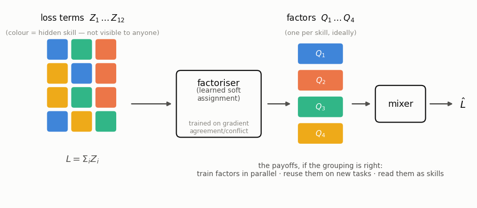
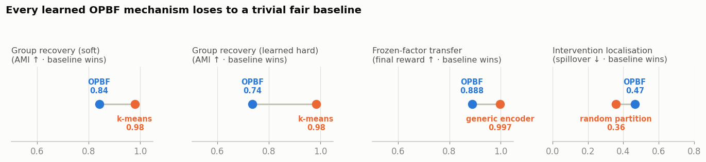
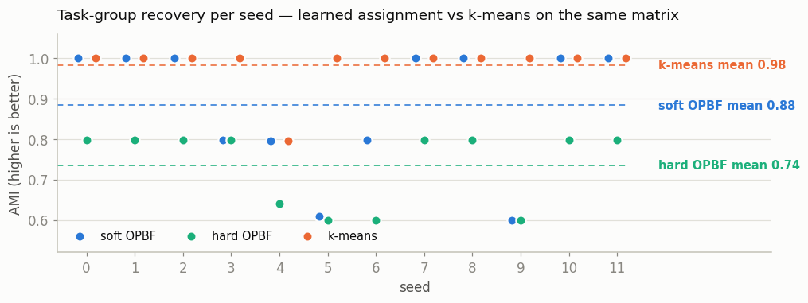
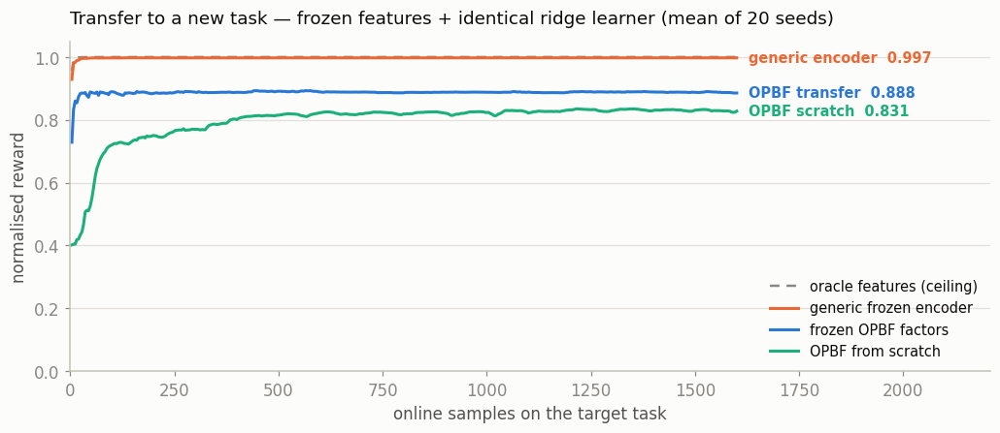
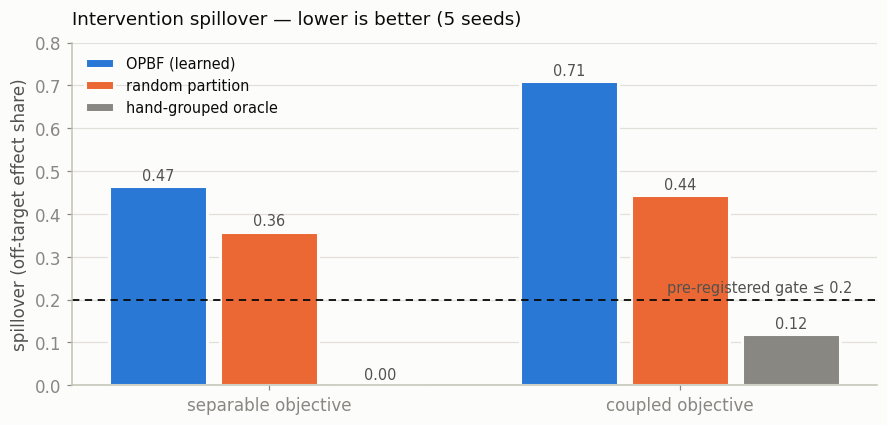
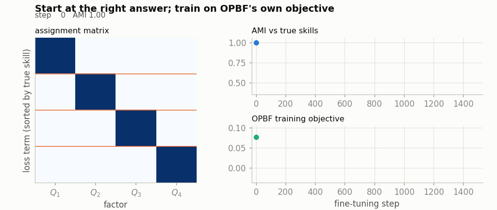

# The proxy attempt (OPBF) — deprecated

> **DEPRECATED.** This is the autopsy of the *first* attempt at learned objective
> factorisation, which approached the problem through a proxy objective (gradient
> affinity). It is superseded by the main article, [The Price of
> Coupling](../BLOG.md), which treats the formulation actually intended — the
> separability gap as the training objective — and does not depend on anything
> here. This page is kept for the record: its warm-start experiment became the main
> project's gate zero, and its numbers are independently revalidated in
> [REVALIDATION.md](../REVALIDATION.md).

---

## The bet

Regroup the $N$ terms of a loss $L = \sum_i Z_i$ into $P \ll N$ latent factors via a
learned, differentiable soft assignment (a *factoriser*) plus a mixer that
recombines the factors so the total loss is preserved — trained end to end, with the
identifying work done by gradient affinity: co-assign terms whose gradients agree,
separate terms whose gradients oppose, reconstruct the sum, stay spiky:

$$\mathcal{L} = w_{rec}\,\frac{\mathrm{MSE}(\hat L, L)}{\mathrm{Var}(L)}
\;+\; w_{cpl}\,\Big[\tfrac{\sum_{ik} R_{ik}\lVert A_i - A_k\rVert^2}{\sum R}
+ \lambda_c\tfrac{\sum_{ik} C_{ik}\langle A_i, A_k\rangle}{\sum C}\Big]
\;+\; \lambda_H H(A_i) - \lambda_U H(\text{usage}),$$

with $R_{ik} = \max(0, \cos(\nabla Z_i, \nabla Z_k))$,
$C_{ik} = \max(0, -\cos(\nabla Z_i, \nabla Z_k))$.

## The scoreboard

Every claimed win had to beat the dumbest fair opponent given identical information,
under pre-registered numeric gates. The opponents went seven for seven:

| Claim under test | Fair opponent | Result | |
|---|---|---|---|
| recovers skill groups (soft) | k-means, same matrix | 0.84 vs **0.98** AMI | [data](../data/e7_results.json) |
| recovers skill groups (learned hard) | k-means | 0.73 vs **0.98**, p=5e-4 | [rerun](../revalidation/probe_e7_hard_rerun.txt) |
| frozen factors transfer | generic encoder, equal size | 0.888 vs **0.997**, p=5e-5 | [data](../data/e6_results.json) |
| decomposition is interpretable | random partition | spillover 0.47/0.71 vs **0.36/0.44** | [data](../data/e9_results.json) |
| conflict-aware optimiser wins under drift | GradVac (2021) | tie; smoothing *hurts* under fast drift | [data](../data/e10_results.json) |
| conflict signal as training diagnostic | PCGrad + momentum | 0.057 vs **0.042** | [rerun](../revalidation/e11_tpcgrad_repro.txt) |
| active probing identifies structure | uniform coverage | tie at AMI 1.0 | — |

## The mechanism of death

The decisive experiment, run during revalidation: initialise the factoriser's
assignment at the true partition (AMI 1.0) and keep training on its own objective.
The loss decreases monotonically while the correct partition dissolves — on these
seeds the objective's minimum simply is not the true grouping. Not a stuck
optimiser: there is nothing to escape when you start at the target. The proxy for
"having found the structure" had its own preferences.

Root cause, as the project's own closing report put it: learned soft grouping is a
**dominated middle** — where structure is recoverable, crisp classical methods read
it better; where it isn't, softness converts "unknown" into "lossy" and every
downstream payoff inherits the loss.

## What carried forward

The warm-start-at-the-answer test (now the main project's gate zero), the
fair-dumb-baseline discipline, out-of-sample holdout (which flipped two in-sample
wins here), the working authority-handover controller, and one methodological
correction found in revalidation: one figure in the closing report ("NMAE ≈ 0.003")
was contradicted by its own raw data (0.16) and is not cited anywhere.

*Raw data: [../data/](../data/). Independent revalidation of every number above:
[../REVALIDATION.md](../REVALIDATION.md) with re-run logs in
[../revalidation/](../revalidation/).*
